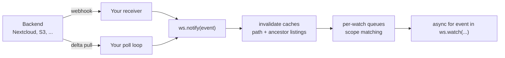

## What It Does

Files on a mounted backend change outside your workspace all the time: a
teammate uploads to Nextcloud, a pipeline rewrites an S3 object, a cron job
deletes a report. `watch` turns those external changes into an async event
stream, so an agent reacts instead of rescanning and diffing directories.

```python
from mirage import Workspace
from mirage.resource.nextcloud import NextcloudConfig, NextcloudResource

ws = Workspace({"/nc": NextcloudResource(NextcloudConfig(...))})

async for event in ws.watch("/nc/Documents"):
    print(event.kind, event.path.virtual)   # e.g. "update /nc/Documents/report.txt"
    result = await ws.execute(f"cat {event.path.virtual}")  # guaranteed fresh
```

No setup call is needed: the watch runtime attaches lazily on first use, and an
idle workspace carries no watch state at all. Mirage runs **no server and no
background loop**. Detection is yours (a webhook receiver or a small poll
loop); Mirage's job is everything after the signal: cache invalidation, scope
matching, and delivery.



## Scopes

The root's shape defines the depth, GNU shell glob style. `*` never crosses
`/`, and matching happens at delivery time, so files created after the watch
started still match.

| root | scope |
| --- | --- |
| `/nc/data` | the whole subtree |
| `/nc/data/*` | the entries at that level only (shallow, no descent) |
| `/nc/data/*/` | everything inside child directories (GNU `*/` matches directories) |
| `/nc/data/*.txt` | the `.txt` entries at that level |
| `/nc/data/*/reports/` | everything inside each child's `reports` directory |
| `["/nc/docs", "/nc/cfg/app.yaml"]` | any of several roots, one event stream |

```python
async for event in ws.watch("/nc/data/*.pdf"):   # pattern
    ...

async for event in ws.watch(["/nc/inbox/*", "/nc/config"]):  # list
    ...
```

## The Event

```python
@dataclass(frozen=True, slots=True)
class FileEvent:
    kind: FileChangeKind                   # create / update / delete / move / unknown
    path: PathSpec                         # virtual path of the changed entry
    timestamp: datetime                    # UTC time the change was observed
    previous_path: PathSpec | None = None  # prior path for MOVE events
    metadata: FileMetadata | None = None   # post-change metadata, when the source has it
```

`FileMetadata` carries `fingerprint` (the backend's ETag/rev, or an
`mtime|size` composite), `size`, and `modified`. Producers fill only what their
signal honestly knows: a listing walk fills all three, a webhook payload none.

`unknown` is the overflow signal: if a burst exceeds the queue cap, pending
events collapse into one `unknown` event at the watch root, meaning
"re-inventory this subtree". Precision degrades; dirtiness is never lost.

Events are **level-triggered**: an event says *what is dirty*, not every
intermediate edit. Read current content through the workspace after receiving
one. That read is guaranteed fresh, because Mirage invalidates the changed
path's cache entries, and every cached ancestor listing up to the mount root,
*before* the event reaches any subscriber.

## Push Mode

Host a small endpoint in your own service, map the provider payload to a
`FileEvent`, and inject it with `ws.notify`. For Nextcloud, the
`webhook_listeners` app (Nextcloud 30+) POSTs on every file event:

```python
async def handle(request):                     # your aiohttp/FastAPI route
    payload = await request.json()
    kind = KIND_BY_CLASS.get(payload["event"]["class"])   # NodeCreatedEvent -> create ...
    node = payload["event"]["node"]["path"]               # /admin/files/data/report.txt
    virtual = "/nc/" + node.removeprefix("/admin/files/") # -> /nc/data/report.txt
    await ws.notify(FileEvent(kind=kind,
                              path=PathSpec.from_str_path(virtual),
                              timestamp=datetime.now(timezone.utc)))
    return web.json_response({"ok": True})
```

The full runnable version, including the one-time `occ` registration commands,
is [`examples/python/nextcloud/watch.py`](https://github.com/strukto-ai/mirage/blob/main/examples/python/nextcloud/watch.py).

## Pull Mode

Backends that implement `delta_hook()` (Nextcloud today) answer one question:
*what changed under this root since the last checkpoint?* A baseline pull
(`checkpoint=None`) emits nothing; every later pull diffs against the
checkpoint you hand back. The whole consumer poller is:

```python
hook = ws.registry.mount_for("/nc").resource.delta_hook()
checkpoint = None
while True:
    delta = await hook.pull(root, checkpoint)
    checkpoint = delta.checkpoint
    for event in delta.changes:
        await ws.notify(event)
    await asyncio.sleep(30)
```

Pull is self-healing: it diffs current backend state against your checkpoint,
so events missed while your service was down surface on the next pull. A
common production shape is push-first with a pull at startup as recovery, or
webhook-as-doorbell: on any webhook, pump the pull once and trust its diff
rather than the payload.

## Queues

Each `watch()` owns a delivery queue. The default `RAMWatchQueue` coalesces
per path with level-triggered semantics (create then update stays create;
create then delete cancels; delete then create becomes update), so pending
size is bounded by distinct dirty paths, not event volume. Overflow policy is
`collapse` (default, the `unknown` rescan event), `drop_oldest`, or `error`.

To customize, attach the runtime explicitly before the first watch:

```python
from mirage.watch import enable_watch

watcher = enable_watch(ws, queue_factory=MyRedisWatchQueue)
```

Any object satisfying the async `WatchQueue` protocol (`push` / `pop` /
`pending` / `clear` / `close`) drops in, so a Redis- or SQS-backed queue needs
no interface changes.

## Scope Notes

- Python only for now; the TypeScript mirror is planned.
- Nextcloud is the first backend with a `delta_hook`; push mode works with any
  backend today since `ws.notify` accepts events from any detection you run.
  See the [Watch Matrix](/python/watch-matrix) for per-resource support.
- Events are in-memory and at-most-once per subscriber; durable queues and
  acknowledgement are future work.
